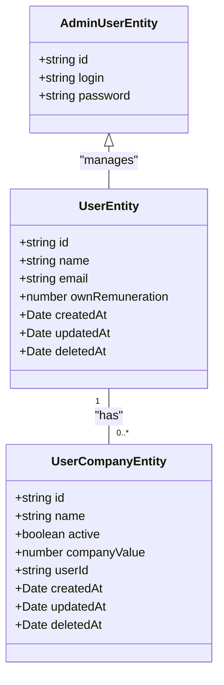

# 🚀 TH Backoffice API

Modern NestJS backend application for backoffice operations management with TypeORM, PostgreSQL, JWT authentication, and comprehensive observability.

## 🚀 Quick Start

### Prerequisites
- Node.js 18+
- Docker & Docker Compose

### Setup
```bash
# Install dependencies
npm install

# Start all services
docker compose up

# Run database migrations
docker exec th-backoffice-api npm run migration:run
```

### Access Points
- **API**: http://localhost:4000
- **Swagger Docs**: http://localhost:4000/swagger
- **Grafana**: http://localhost:3001 (admin/admin)
- **Prometheus**: http://localhost:9090

## 🔑 Authentication

Create an admin user and get your JWT token:

```bash
# Create admin user
POST /admin
{
  "login": "admin",
  "password": "password123"
}

# Login to get JWT token
POST /admin/auth
{
  "login": "admin", 
  "password": "password123"
}
```

Use the token in requests:
```
Authorization: Bearer <your_jwt_token>
```

## 🛠️ Tech Stack

- **Backend**: NestJS 11, TypeORM, PostgreSQL
- **Auth**: JWT
- **Queue**: RabbitMQ, BullMQ
- **Cache**: Redis
- **Docs**: Swagger
- **Observability**: Winston, Prometheus, Grafana, Loki
- **Testing**: Jest

## 📊 Database Schema



## 🧪 Testing

```bash
# Unit tests
npm run test

# Test coverage
npm run test:cov

# E2E tests (TODO)
npm run test:e2e
```

## 📈 Monitoring & Observability

The application includes comprehensive observability:

### Logs (Winston + Loki)
- Structured JSON logs
- Log levels: info, warn, error, debug
- View in Grafana: http://localhost:3001

### Metrics (Prometheus)
- HTTP request metrics
- System performance metrics
- Custom application metrics
- Raw metrics: http://localhost:4000/metrics

### Sample Queries

**Prometheus:**
- Total requests: `http_requests_total`
- Request rate: `rate(http_requests_total[1m])`
- Error rate: `rate(http_request_errors_total[5m])`

**Loki (in Grafana):**
- All logs: `{app="th-backoffice-api"}`
- Error logs: `{app="th-backoffice-api"} |= "error"`

## 📬 Notifications

Uses RabbitMQ and BullMQ for asynchronous notification processing:

- **RabbitMQ**: Message broker for queuing notifications
- **BullMQ**: Job processing with retry logic and monitoring
- **Exchange**: `user.notifications`
- **Queue**: `email-notifications`

## 🏗️ Architecture Principles

- **Clean Architecture**: Well-defined layers with clear separation of concerns
- **Dependency Injection**: Using NestJS native DI container
- **DTO Pattern**: Data Transfer Objects for validation and type safety
- **Repository Pattern**: Database operation abstraction
- **Soft Delete**: Logical deletion for audit and data recovery
- **Multi-environment Config**: Flexible configuration via `.env` files

## 📝 Development Guidelines

This project follows:
- Clean code principles
- English as default language
- No comments in code (self-documenting code)
- Comprehensive testing
- Type safety with TypeScript

---

## 📋 Detailed Information

<details>
<summary>🐳 Docker Configuration Details</summary>

The Docker setup includes:
- Application container
- PostgreSQL database
- Redis cache
- RabbitMQ message broker
- Prometheus metrics collection
- Grafana visualization
- Loki log aggregation

All services are orchestrated via `docker-compose.yml` for easy development and deployment.

</details>

<details>
<summary>🚀 Production Deployment Considerations</summary>

For production deployment:
- Use environment-specific configuration files
- Set up proper secrets management
- Configure load balancing
- Set up backup strategies for PostgreSQL
- Monitor resource usage and scale accordingly
- Set up alerting rules in Prometheus

</details>

<details>
<summary>📊 Development Team Estimation</summary>

### Time Estimate for Admin Panel Development

**MVP Phase**: 2-3 months  
**Complete Development**: +3-6 months  
**Refinement & Stabilization**: +2-3 months  
**Total**: 7-12 months

### Team Structure

- **1 Tech Lead**: Architecture and technical decisions (4-5+ years experience)
- **1 Senior Developer**: Complex implementations and mentoring (4+ years experience)  
- **2 Junior/Mid Developers**: Feature implementation and growth (1-3 years experience)

This structure ensures knowledge sharing and continuous learning while maintaining code quality and consistency.

</details>
