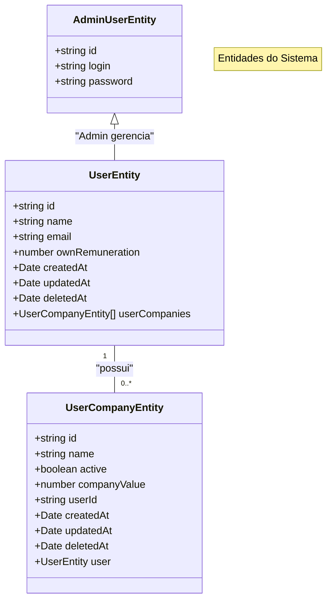

# 🚀 Teddy Backoffice API

Uma aplicação backend moderna em NestJS para gerenciamento de operações de backoffice com TypeORM, PostgreSQL, autenticação JWT e observabilidade completa.

## 📋 Estrutura do Projeto

### 🛠️ Tecnologias Utilizadas

- **[NestJS](https://nestjs.com/)** (v11) - Framework Node.js progressivo
- **[TypeORM](https://typeorm.io/)** - ORM para TypeScript e JavaScript
- **[PostgreSQL](https://www.postgresql.org/)** - Banco de dados relacional poderoso e de código aberto
- **[JWT](https://jwt.io/)** - JSON Web Token para autenticação segura
- **[Swagger](https://swagger.io/)** - Documentação de API
- **[Jest](https://jestjs.io/)** - Framework de testes
- **[Winston](https://github.com/winstonjs/winston)** - Biblioteca de logging
- **[Loki](https://grafana.com/oss/loki/)** - Sistema de agregação de logs
- **[Prometheus](https://prometheus.io/)** - Sistema de monitoramento e alerta
- **[Grafana](https://grafana.com/)** - Plataforma de visualização e análise
- **[Jaeger](https://www.jaegertracing.io/)** - Sistema de rastreamento distribuído

### 📊 Diagrama de Relação entre Entidades



### 🏗️ Arquitetura e Princípios de Design

- **Arquitetura Limpa** - Implementação de camadas bem definidas com separação clara de responsabilidades
- **Injeção de Dependência** - Utilização do container DI nativo do NestJS para acoplamento fraco
- **Padrão DTO** - Objetos de Transferência de Dados para validação robusta e segurança de tipos
- **Padrão Repository** - Abstração elegante para operações de banco de dados
- **Configuração Multi-ambiente** - Gerenciamento flexível de configurações via arquivos `.env`
- **Sistema de Migração** - Controle de versão de banco de dados com migrações automatizadas
- **Versionamento de API** - Estratégia de versionamento baseada em URI para evolução contínua
- **Validação Global** - Sistema abrangente de validação usando class-validator
- **Soft Delete** - Implementação de exclusão lógica para auditoria e recuperação de dados
- **Observabilidade Completa** - Logs estruturados, métricas e rastreamento distribuído

## 📊 Observabilidade

O projeto implementa uma stack completa de observabilidade que inclui:

### 📝 Logging (Winston + Loki)

- Logs estruturados em JSON
- Integração com Loki para armazenamento e consulta de logs
- Visualização de logs no Grafana
- Níveis de log configuráveis (info, warn, error, debug)
- Contexto de logs para facilitar a depuração

### 📈 Métricas (Prometheus)

- Métricas padrão do sistema (CPU, memória, etc.)
- Métricas personalizadas de aplicação:
  - Contagem total de requisições HTTP
  - Duração das requisições
  - Requisições em andamento
  - Contagem de erros
- Endpoint `/metrics` para coleta pelo Prometheus
- Dashboards no Grafana para visualização

### 🔍 Rastreamento (Jaeger)

- Rastreamento de requisições HTTP
- Visualização de traces no Jaeger UI
- Análise de latência e gargalos
- Correlação entre serviços

## 🐳 Implantação com Docker

Nossa configuração Docker oferece um ambiente isolado e reproduzível para execução da aplicação, incluindo toda a stack de observabilidade.

### Recursos Disponíveis

Após iniciar os contêineres com `docker compose up`, você pode acessar:

- **API:** http://localhost:4000
- **Documentação Swagger:** http://localhost:4000/swagger
- **Grafana:** http://localhost:3001 (usuário: admin, senha: admin)
- **Prometheus:** http://localhost:9090
- **Jaeger UI:** http://localhost:16686

### Configurando o Grafana

Após iniciar os contêineres, você pode configurar dashboards no Grafana:

1. Acesse http://localhost:3001 e faça login com usuário `admin` e senha `admin`
2. Vá para "Dashboards" > "New" > "New Dashboard"
3. Adicione painéis usando as fontes de dados Prometheus e Loki

#### Exemplos de consultas Prometheus:

- Total de requisições: `http_requests_total`
- Duração média das requisições: `rate(http_request_duration_seconds_sum[5m]) / rate(http_request_duration_seconds_count[5m])`
- Requisições por segundo: `rate(http_requests_total[1m])`
- Taxa de erros: `rate(http_request_errors_total[5m])`

#### Exemplos de consultas Loki:

- Todos os logs: `{app="teddy-backoffice-api"}`
- Logs de erro: `{app="teddy-backoffice-api"} |= "error"`
- Logs de um serviço específico: `{app="teddy-backoffice-api", context="UserService"}`
- Logs de requisições HTTP: `{app="teddy-backoffice-api", context="HttpRequest"}`

## 🔍 Monitoramento e Depuração

### Visualizando Logs

Os logs são enviados para o console e para o Loki. Para visualizar os logs:

1. **Console:** Visíveis diretamente no terminal onde a aplicação está sendo executada
2. **Grafana:** Acesse http://localhost:3001, vá para "Explore" e selecione a fonte de dados "Loki"

### Monitorando Métricas

As métricas da aplicação podem ser visualizadas de várias formas:

1. **Endpoint de Métricas:** Acesse http://localhost:4000/metrics para ver as métricas brutas
2. **Prometheus:** Acesse http://localhost:9090 para consultar e visualizar métricas
3. **Grafana:** Acesse http://localhost:3001 para visualizar dashboards com métricas

### Analisando Traces

Para visualizar e analisar traces de requisições:

1. Acesse a UI do Jaeger em http://localhost:16686
2. Selecione o serviço "teddy-backoffice-api" no menu suspenso
3. Defina os filtros desejados e clique em "Find Traces"
4. Clique em um trace para ver detalhes e spans individuais

## 🔒 Autenticação

A API usa JWT para autenticação. Rotas protegidas requerem um token JWT válido no cabeçalho Authorization:

```
Authorization: Bearer <seu_token_jwt>
```

Para obter um token, use o endpoint de login de administrador:

```
POST /admin/auth
{
  "login": "admin",
  "password": "password123"
}
```

Para criar um usuário admin, você pode usar a seguinte rota:

```
POST /admin
{
  "login": "admin",
  "password": "password123"
}
```

> 💡 **Nota:** Esta rota foi liberada por se tratar de um repositório de teste, permitindo a criação de usuários admins para facilitar o desenvolvimento e testes.

## 🧪 Executando Testes

```bash
# Testes unitários
npm run test

# Cobertura de testes
npm run test:cov

# TODO: Testes E2E
npm run test:e2e
```

## 📝 Documentação da API

Quando executada no modo de desenvolvimento ou local, a documentação Swagger está disponível em:

```
http://localhost:4000/swagger
```
