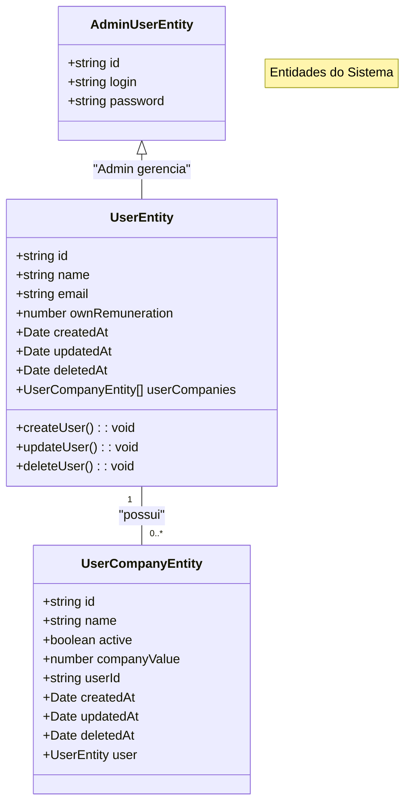

# 🚀 Teddy Backoffice API

Uma aplicação backend moderna em NestJS para gerenciamento de operações de backoffice com TypeORM, PostgreSQL e autenticação JWT.

## 📋 Estrutura do Projeto

### 🛠️ Tecnologias Utilizadas

- **[NestJS](https://nestjs.com/)** (v11) - Framework Node.js progressivo
- **[TypeORM](https://typeorm.io/)** - ORM para TypeScript e JavaScript
- **[PostgreSQL](https://www.postgresql.org/)** - Banco de dados relacional poderoso e de código aberto
- **[JWT](https://jwt.io/)** - JSON Web Token para autenticação segura
- **[Swagger](https://swagger.io/)** - Documentação de API
- **[Jest](https://jestjs.io/)** - Framework de testes

### 📊 Diagrama de Relação entre Entidades



### 🏗️ Arquitetura e Princípios de Design

- **Arquitetura Limpa** - Implementação de camadas bem definidas com separação clara de responsabilidades
- **Injeção de Dependência** - Utilização do container DI nativo do NestJS para acoplamento fraco
- **Padrão DTO** - Objetos de Transferência de Dados para validação robusta e segurança de tipos
- **Padrão Repository** - Abstração elegante para operações de banco de dados
- **Configuração Multi-ambiente** - Gerenciamento flexível de configurações via arquivos `.env`
- **Sistema de Migração** - Controle de versão de banco de dados com migrações automatizadas
- **Versionamento de API** - Estratégia de versionamento baseada em URI para evolução contínua
- **Validação Global** - Sistema abrangente de validação usando class-validator
- **Soft Delete** - Implementação de exclusão lógica para auditoria e recuperação de dados

## 🐳 Implantação com Docker

Nossa configuração Docker oferece um ambiente isolado e reproduzível para execução da aplicação.

### Pré-requisitos

- [Docker](https://www.docker.com/get-started)
- [Docker Compose](https://docs.docker.com/compose/install/)

### Implantação Rápida

1. **Clone o repositório**

```bash
git clone https://github.com/seu-usuario/teddy-backoffice-api.git
cd teddy-backoffice-api
```

2. **Inicie a aplicação**

```bash
docker compose up
```

Este comando configura automaticamente:

- Contêiner da API com todas as dependências
- Banco de dados PostgreSQL pré-configurado
- Rede interna para comunicação segura entre serviços

> 💡 **Dica para Produção:** Use `docker-compose up -d` para execução em segundo plano.

3. **Execute as migrações do banco de dados**

```bash
docker exec teddy-backoffice-api npm run migration:run
```

4. **Acesse os recursos**

- **API:** http://localhost:3000
- **Documentação Swagger:** http://localhost:3000/swagger

## 💻 Executando Localmente (Sem Docker)

### Pré-requisitos

- [Node.js](https://nodejs.org/) (v20 ou posterior)
- [npm](https://www.npmjs.com/)
- [PostgreSQL](https://www.postgresql.org/) (v16 recomendado)

### Passos para Executar Localmente

1. **Clone o repositório**

```bash
git clone https://github.com/seu-usuario/teddy-backoffice-api.git
cd teddy-backoffice-api
```

2. **Instale as dependências**

```bash
npm install
```

3. **Configure as variáveis de ambiente**

Crie um arquivo `.env` no diretório raiz baseado no arquivo `.env.example`:

```bash
cp .env.example .env
```

Atualize as configurações de conexão do banco de dados no `.env`:

```
DB_HOST_READ_WRITE=localhost
DB_HOST_READ_ONLY=localhost
DB_PORT=5432
DB_DATABASE=teddy_core
DB_USERNAME=seu_usuario_postgres
DB_PASSWORD=sua_senha_postgres
NODE_ENV=local

JWT_SECRET=sua_chave_secreta
JWT_EXPIRES_IN=1d
```

4. **Crie o banco de dados** (sugestão)

```bash
# Conecte ao PostgreSQL
psql -U postgres

# Crie o banco de dados e o usuário
CREATE DATABASE teddy_core;
CREATE USER teddy WITH ENCRYPTED PASSWORD 'password';
GRANT ALL PRIVILEGES ON DATABASE teddy_core TO teddy;

# Saia do PostgreSQL
\q
```

> 💡 **Nota:** Este passo é apenas uma sugestão. Existem outros métodos para criar o banco de dados e o usuário.

5. **Execute as migrações do banco de dados**

```bash
npm run migration:run
```

6. **Inicie a aplicação no modo de desenvolvimento**

```bash
npm run start:dev
```

7. **Acesse a API**

A API estará disponível em http://localhost:3000

8. **Acesse a documentação Swagger**

A UI do Swagger está disponível em http://localhost:3000/swagger

## 🔒 Autenticação

A API usa JWT para autenticação. Rotas protegidas requerem um token JWT válido no cabeçalho Authorization:

```
Authorization: Bearer <seu_token_jwt>
```

Para obter um token, use o endpoint de login de administrador:

```
POST /admin/login
{
  "login": "admin",
  "password": "password123"
}
```

Para criar um usuário admin, você pode usar a seguinte rota:

```
POST /admin
{
  "login": "admin",
  "password": "password123"
}
```

> 💡 **Nota:** Esta rota foi liberada por se tratar de um repositório de teste, permitindo a criação de usuários admins para facilitar o desenvolvimento e testes.

## 🧪 Executando Testes

```bash
# Testes unitários
npm run test

# Cobertura de testes
npm run test:cov

# TODO: Testes E2E
npm run test:e2e
```

## 📝 Documentação da API

Quando executada no modo de desenvolvimento ou local, a documentação Swagger está disponível em:

```
http://localhost:3000/swagger
```
